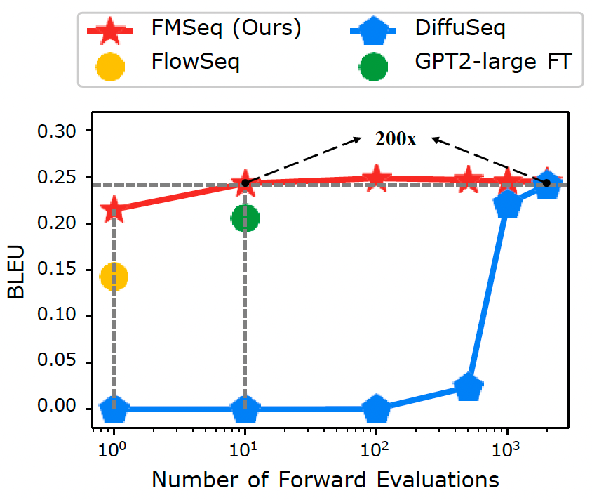
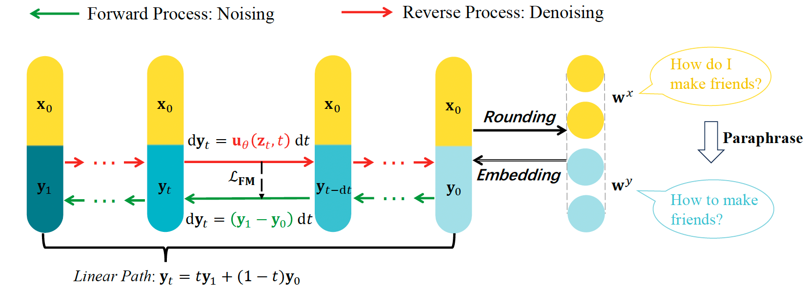

# FMSeq
> Official Codebase for [*Enable Fast Sampling for Seq2Seq Text Diffusion*](https://aclanthology.org/2024.findings-emnlp.497/).


<div style="display: flex; justify-content: center;">
    
    
</div>

**Performance**: Picture on the left shows BLEU Scores of different models for the paraphrase task on the QQP dataset. Our FMSeq beats all the models when using a single sampling step and achieves comparable performance to DiffuSeq (2000 steps) with only 10 steps.
**Workflow**: Picture on the right shows workflow of FMSeq. We utilize embedding to map the discrete token space into a continuous space. The forward process diffuses the target embedding along a linear path, and the model fits the velocity of the target part conditioned on clean source embedding and noisy target embedding.

## Dataset
Prepare datasets and put them under the `datasets` folder. Take `datasets/CommonsenseConversation/train.jsonl` as an example. We use four datasets in our paper.

| Task | Datasets | Source |
|-|-|-|
| Open-domain Dialogue | CommonsenseConversation | [download](https://drive.google.com/drive/folders/1D6PxrfB1410XFJVGnbXR5bGhb-ulIX_l?usp=sharing)|
| Question Generation | Quasar-T |[download](https://drive.google.com/drive/folders/1D6PxrfB1410XFJVGnbXR5bGhb-ulIX_l?usp=sharing) |
| Text Simplification | Wiki-alignment | [download](https://drive.google.com/drive/folders/1D6PxrfB1410XFJVGnbXR5bGhb-ulIX_l?usp=sharing)|
| Paraphrase | QQP-Official |[download](https://drive.google.com/drive/folders/1D6PxrfB1410XFJVGnbXR5bGhb-ulIX_l?usp=sharing) |
| Machine Translation | iwslt14-de-en | [download](https://drive.google.com/drive/folders/1D6PxrfB1410XFJVGnbXR5bGhb-ulIX_l?usp=sharing)|

## Training
For Non-MT (Machine Translation) tasks, run:
```bash
cd scripts
# qqp:
bash train_qqp.sh
# others: modify learning_steps, dataset, data_dir, notes
```

For MT tasks, run:
```bash
cd scripts
bash train_de2en.sh
```

The trained checkpoints are provided here: [link of ckpt](https://drive.google.com/drive/folders/1f3p7FHcBA7c_ZMQo8tbowEHSAu_-xLSP?usp=sharing)

## Decoding
```bash
cd scripts
bash run_decode.sh
# core parameters: step and td
```

## Evaluation
```bash
cd scripts
bash eval.sh
# you can eval single file or multiple file which are in the same folder (mbr in default)
```

## Citation
Please add the citation if our paper or code helps you.
```tex
@inproceedings{liu2024enable,
  title={Enable Fast Sampling for Seq2Seq Text Diffusion},
  author={Liu, Pan and Tian, Xiaohua and Lin, Zhouhan},
  booktitle={Findings of the Association for Computational Linguistics: EMNLP 2024},
  pages={8495--8505},
  year={2024}
}
```
## Acknowledgements
This implementation is based on [DiffuSeq](https://github.com/Shark-NLP/DiffuSeq.git)


